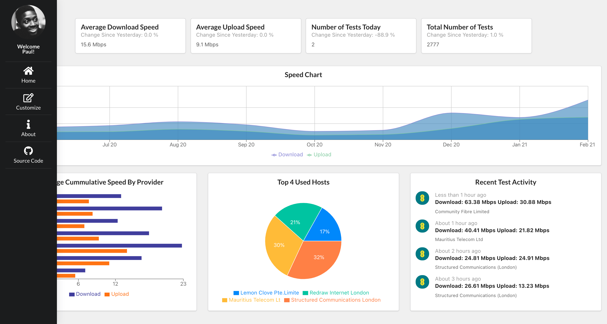

# Internet Speed Monitoring Dashboard

<a href="https://master.dsei5kjb4zhw1.amplifyapp.com/">Click here to Visit Application</a>

## Background
My ISP is pretty bad and I have complained about the lagging speeds for weeks.
The internet seems to experience times where it is just a deadband and then returns to normal function.
I made a bunch of bash scripts to run speed tests every hour to collect data about the speeds.

## Implementation
* generate_report.sh performs the speed test every hour and inserts the data into a SQL database
* Application front end is built with React, Recharts and Semantic UI
* Backend is built with Node.js, Express and SQL database.
* Front End and Back End are hosted on AWS.

## Dashboard View

